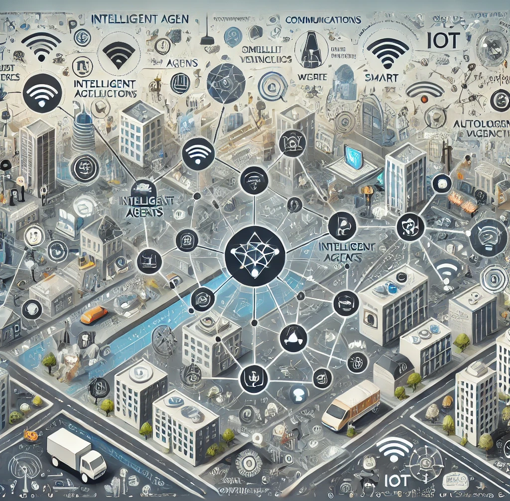

## Hi there 👋

# ICONs - Intelligent Agents Networking and Communications

Welcome to the ICONs (Intelligent Agents Networking and Communications) research team's repository. We are a dedicated group of researchers focused on advancing the field of intelligent agents networking and communications technologies. 
Our work spans various domains, including sensor technologies, communication systems, and the integration of these systems into intelligent networks.

## Table of Contents

- [About Us](#about-us)
- [Research Focus](#research-focus)
- [Our Team](#our-team)
- [Projects](#projects)
- [Publications](#publications)
- [Collaborations](#collaborations)
- [Contact Us](#contact-us)

## About Us

The ICONs research team is committed to exploring and developing innovative solutions in the field of intelligent networking communications. Our goal is to enhance connectivity, improve network efficiency, and support the deployment of intelligent systems in various applications such as smart cities, autonomous vehicles, and IoT ecosystems.

## Research Focus

Our research areas include, but are not limited to:

- **Sensor Technologies**: Developing and integrating advanced sensor systems for accurate data acquisition and environmental monitoring.
- **Communication Systems**: Investigating new protocols and algorithms to improve the reliability, speed, and efficiency of communication networks.
- **Intelligent Networking**: Creating intelligent networks that leverage machine learning and artificial intelligence to optimize performance and adaptability.
- **IoT and Smart Systems**: Designing and implementing IoT frameworks and smart systems for enhanced automation and control.

## Our Team

Our team comprises experts from diverse backgrounds, including electrical engineering, computer science, and telecommunications. We collaborate closely to address complex challenges in the field of intelligent networking communications.

### Team Members

- TongZhou Yang
- Chongyang Guo
- **[Member 3]** - 
- **[Member 4]** - 

(Include brief bios and links to profiles if available)

## Projects

### Ongoing Projects

- **Project 1**: Digital Twin-Driven Machine-type E2E Transmission Reliability and Network Resource Optimization in Industrial Internet, Jan. 2023–Dec. 2025
- **Project 2**: Research on ultra-High Reliable Transmission Technology in Industrial Internet Empowered by Smart Twins, Jan. 2023–Dec. 2025
- **Project 3**: Cybertwin-enabled Novel Intelligent Network Architecture Technology and Experimental Platform, Jan. 2021–Dec. 2025

### Completed Projects

- **Project A**: Description of Project A.
- **Project B**: Description of Project B.

## Publications

We publish our research findings in leading journals and conferences. Below are some of our recent publications:

1. **Channel-Aware Latency Tail Taming in Industrial IoT** - IEEE Transactions on Wireless Communications
2. **Channel-based Optimal Back-off Delay Control in Delay-Constrained Industrial WSNs** - IEEE Transactions on Wireless Communications
3. **Title of Paper 3** - Journal/Conference, Year

(Include links to the publications if available)

## Collaborations

We actively seek collaborations with academic institutions, industry partners, and other research groups. If you are interested in collaborating with us, please reach out!

## Contact Us

For more information about our research, projects, or collaboration opportunities, please contact us:

- **Email**: [qihaol@jlu.edu.cn](mailto:qihaol@jlu.edu.com)
- **Address**: College of Communication Engineering, Jilin University, No.5372, Nanhu Road, Changchun, Jilin, China

---

Thank you for visiting our repository. We look forward to engaging with the research community and advancing the field of intelligent networking communications together.

<!--

**Here are some ideas to get you started:**

🙋‍♀️ A short introduction - what is your organization all about?
🌈 Contribution guidelines - how can the community get involved?
👩‍💻 Useful resources - where can the community find your docs? Is there anything else the community should know?
🍿 Fun facts - what does your team eat for breakfast?
🧙 Remember, you can do mighty things with the power of [Markdown](https://docs.github.com/github/writing-on-github/getting-started-with-writing-and-formatting-on-github/basic-writing-and-formatting-syntax)
-->
